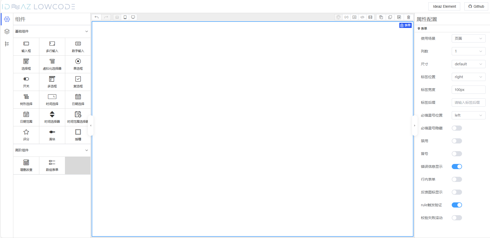

  

  Based on <a href="https://github.com/NaiveSteven/ideaz-element" target="_blank" rel="noopener noreferrer">Ideaz Element</a>, Low code tool for middle and background

  If you have created any awesome thing with Ideaz LowCode and would like to showcase it on the official website, you can contact me. If you would like to contribute code, you are very welcome!

**English** | [中文](./README.zh-CN.md)

If you are worrying about something builder, Such as form builder/table builder etc. Ideaz LowCode is your perfect choice.

## Screenshot

## Features

- ⚡ High performance, Smooth and beautiful drag and drop experience
- 🔨 Full scene coverage
- 💪 Strong scalability
- 🎨 Support Low Code
- 👀 Close to business code arrangement, low source code reading threshold
- 🩹 It is suitable for middle - and back-office services

## Documentation

[Here](https://naivesteven.github.io/ideaz-lowcode/) you can view the online document.

## Help

Open a [issue](https://github.com/NaiveSteven/ideaz-lowcode/issues) to request help.
